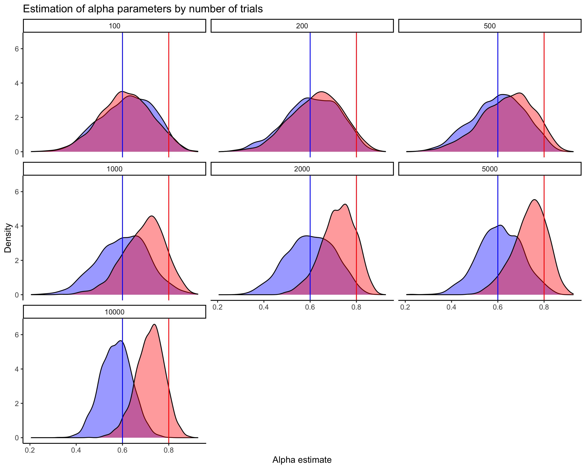
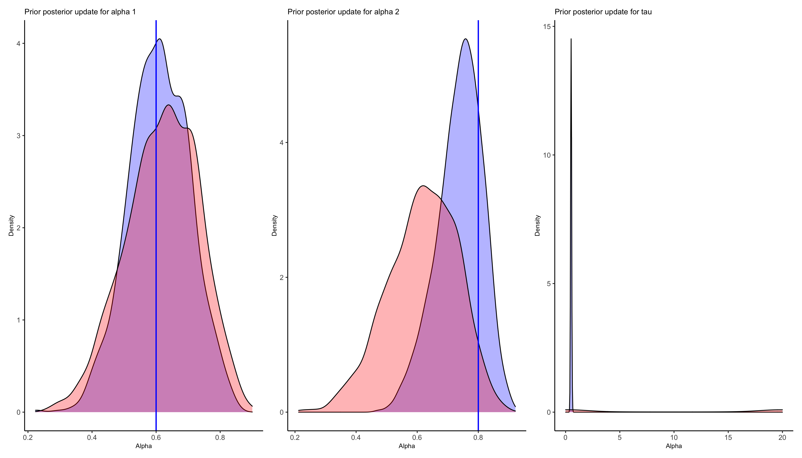

# ACM_assignment4
this is 4 riccardo

## Experimental setup
In this assignment, we are implementing a reinforcement learning model. 
We simulate an experiment in which participants pick between two choices in each trial. 
These two choices have constant and proportional reward probabilities (e.g. if `p(choice_1) = 0.8`, then `p(choice_2) = 0.2`). 
The agent implicitly learns these reward probabilities by attributing values to the two choices;
Value, or expectation of reward on next trial if choice c is picked, is updated each trial following:

)
<!--$$ V_{t+1}^{c} = V^{c}_{t} + \alpha (R_t - V^{c}_{t}) $$--> 

where t is trial number, alpha is the learning rate and R is whether reward was achieved or not.
Learning rate serves to weight prediction error.
A high learning rate pushes an agent to update value in bigger increments.

An agent reaches a choice following:

))
<!--$$ Choice ~ Binomial(1, \sigma(V_{t}^{c2} - V_{t}^{c1}, \tau)) $$-->

where sigma is a softmax function, with temperature tau. 
Temperature is the "exponentiality" of the softmax function (see figure bellow).
This parameter can be thought of as agent's explore X exploit bias.
A high temperature pushes the agent to "exploit", meaning having higher probability to pick the more valued choice.

## Simulation
We simulate data for two conditions:  
1) `alpha = 0.6`
2) `alpha = 0.8`

While having fixed reward probability: `p(choice_1) = 0.75` and `p(choice_2) = 0.25`;
And fixed temperature `tau = 0.5` (value is non-deterministic in making choice). The agent plays for 10000 in each of the two conditions, giving a total of 20000 trials. 

The agents chooses an option following the decision rule described above, and updates its value of that choice based on the learning rate. Learning rates were set to 0.8 for condition 1, and 0.6 for condition 2. The agent's belief of the reward probability of option 1 under each of the two conditions can be seen below:

Clearly, the agent is updating the expected value of the option too much for both conditions, especially with a learning of 0.8. It is not a problem for the parameter recovery that the agent to such a high degree misjudges the true reward probability, but we nevertheless ran a third agent simulation (not used in parameter recovery) where the agent has a learning rate of 0.4 instead to illustrate the effect on reward probability estimation (see figure below)

## Parameter recovery model

We fit a model on the simulated data, aiming to recover the alpha- and tau values used in data generation. In order to estimate the required number of trials to correctly recover the parameters, we fit multiple models using subsets of the data of varrying length (stopping after seeing the first n trials from each condition, with n = 50, 100, 250, 500, 1000, 2500, 5000, 10000). 

We use the following model formulation:  

)
<!--$$ Prior_{\alpha} \sim Normal(1, 1) $$--> 
)
<!--$$ \alpha_1 \sim Normal_{lpdf}(\alpha_1 | Prior_{\alpha}) $$--> 
)
<!--$$ \alpha_2 \sim Normal_{lpdf}(\alpha_2 | Prior_{\alpha}) $$--> 

)
<!--$$ Prior_{\tau} \sim Normal(0, 20) $$--> 
)
<!--$$ \tau \sim Normal_{lpdf}(\tau | Prior_{\tau}) $$--> 

From here, we sample alphas from different model fits, increasing the length of data subset (or n trials) over time:  

  

From the figure above, we argue that reasonable estimations of learning rate does not happen until around 10000 trials (5000 of each condition). We also notice that estimations of learning rate in condition 2 (`alpha = 0.8`) take form earlier than estimations of learning rate in condition 1 (`alpha = 0.6`). This indicates that higher learning rates are easier to detect, presumably because that leads to a more drastic effect on agent belief and behavior. We would therefore expect that an even higher number of trials would be necessary to recover a learning rate of 0.4. 

## Model quality checks
#### Markov chains
Below we visualise trace plots of the Markov chains. We see that the chains are scattered around a mean and that they seem to converge.  

#### Prior-posterior updates

This figure shows prior(red)-posterior(blue) update checks for the the parameters alpha1 and alpha2. The parameters are estimated by the model based on the priors we set. We see that for both alphas, the posterior is quite narrow and certain around the true alpha (blue line) even given the very wide prior. This increases our belief in that the model has been successfully fitted to the data.

## Iterated design
To produce an iterated design, we simulate a study in which a participant goes through the trials in different sessions (e.g. 5 session with 20 trials in each). We use the same models as described above, however, to accommodate the iterated study design we use a different approach for setting the priors. The first session is initialized with the same priors as outlined earlier. After each session, we save the mean and standard deviation of the estimated alphas and tau. In the next session, these values are then used for the priors for alpha1, alpha2, and tau, assuming normally distributed priors and posteriors. 

By running this on the same simulated data as described above we see that.......

** ANIMATED DENSITY PLOTS ** 
